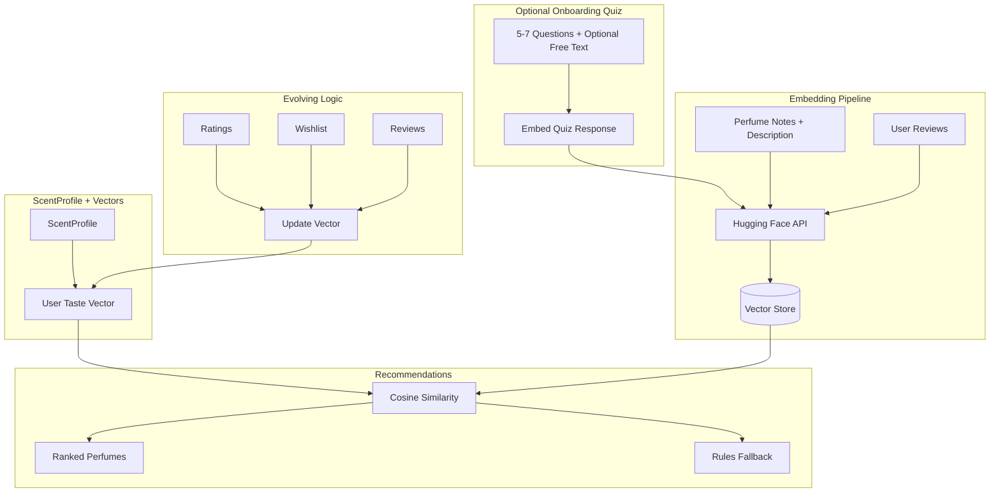

# ML Quiz Migration: Adding ML to the Onboard Quiz

Steps to migrate from the rules-based onboard quiz to an ML-enhanced implementation using embeddings (e.g., Hugging Face). Assumes [onboard-quiz.md](onboard-quiz.md) is implemented and working.

---

## Prerequisites

- [onboard-quiz.md](onboard-quiz.md) fully implemented
- `ScentProfile` model exists
- `RecommendationService` interface in use with `RulesRecommendationService`
- Hugging Face account and API key (or plan to self-host)

---

## Architecture After Migration



---

## Implementation Checklist

### Phase 1: Database and Vector Storage

- [ ] Add `pgvector` extension to PostgreSQL:
  - [ ] Create migration: `CREATE EXTENSION IF NOT EXISTS vector;`
  - [ ] Or use `prisma db execute` with raw SQL
- [ ] Add `PerfumeEmbedding` model to `prisma/schema.prisma`:
  ```prisma
  model PerfumeEmbedding {
    id           String   @id @default(cuid())
    perfumeId    String   @unique
    vector       Unsupported("vector(384)")?  // dimension matches model; Prisma may need pgvector extension
    modelVersion String   @default("all-MiniLM-L6-v2")
    updatedAt    DateTime @updatedAt
    perfume      Perfume  @relation(fields: [perfumeId], references: [id], onDelete: Cascade)
  }
  ```
  - [ ] Note: Use `prisma-extension-pgvector` or raw SQL migrations if Prisma does not support `vector` natively
- [ ] Add `UserTasteEmbedding` model (optional, can store in ScentProfile JSON):
  ```prisma
  model UserTasteEmbedding {
    id           String   @id @default(cuid())
    userId       String   @unique
    vector       Unsupported("vector(384)")?
    modelVersion String   @default("all-MiniLM-L6-v2")
    updatedAt    DateTime @updatedAt
    user         User     @relation(fields: [userId], references: [id], onDelete: Cascade)
  }
  ```
- [ ] Add relation to `Perfume` and `User` models
- [ ] Run migration (may require custom migration for pgvector)
- [ ] Create index for cosine similarity: `CREATE INDEX ON "PerfumeEmbedding" USING ivfflat (vector vector_cosine_ops) WITH (lists = 100);` (adjust lists by row count)

### Phase 2: Embedding Service

- [ ] Add Hugging Face API key to `.env`: `HUGGINGFACE_API_KEY=...`
- [ ] Create `app/services/embeddings/embedding.server.ts`:
  - [ ] Function `embedText(text: string): Promise<number[]>`
  - [ ] Call Hugging Face Inference API (`sentence-transformers/all-MiniLM-L6-v2`)
  - [ ] Handle rate limits, retries, and errors
  - [ ] Batch embedding support for efficiency (HF supports batch)
- [ ] Add `@huggingface/inference` or use `fetch` to HF API
- [ ] Document model choice and vector dimension (384 for MiniLM-L6-v2)

### Phase 3: Perfume Embeddings

- [ ] Create `app/services/embeddings/perfume-embedding.server.ts`:
  - [ ] `buildPerfumeText(perfume)`: concatenate notes (top/heart/base) + description
  - [ ] `embedPerfume(perfumeId)`: fetch perfume, build text, embed, upsert `PerfumeEmbedding`
- [ ] Create script `scripts/embed-all-perfumes.ts`:
  - [ ] Fetch all perfumes with notes and description
  - [ ] Batch embed (e.g., 32 at a time to respect rate limits)
  - [ ] Upsert into `PerfumeEmbedding`
- [ ] Run script for existing perfumes
- [ ] Hook into perfume create/update (admin): call `embedPerfume` when perfume is saved

### Phase 4: User Taste Vector

- [ ] Create `app/services/embeddings/user-taste.server.ts`:
  - [ ] `computeUserTasteVector(userId)`: aggregate from:
    - [ ] Quiz free-text (if added to quiz) or quiz note names concatenated
    - [ ] Perfumes rated 4+ (weighted average of their embeddings)
    - [ ] Wishlisted perfumes (weighted average)
    - [ ] Review text embeddings (average)
  - [ ] `updateUserTasteEmbedding(userId)`: compute vector, upsert `UserTasteEmbedding`
- [ ] Call `updateUserTasteEmbedding` from existing evolution hooks (after rating, wishlist add, review submit)
- [ ] Optional: add free-text question to quiz ("Describe your ideal scent") and include in taste vector

### Phase 5: ML Recommendation Service

- [ ] Create `app/services/recommendations/ml.service.ts`:
  - [ ] Implement `RecommendationService` interface
  - [ ] `getSimilarPerfumes(perfumeId, limit)`: get perfume embedding, run vector similarity search, return top N
  - [ ] `getPersonalizedForUser(userId, limit)`:
    - [ ] If user has `UserTasteEmbedding`: run vector similarity against `PerfumeEmbedding`
    - [ ] Else: call `RulesRecommendationService` as fallback
- [ ] Use raw SQL or Prisma `$queryRaw` for `ORDER BY vector <=> $1 LIMIT N` (pgvector cosine operator)

### Phase 6: Feature Flag and Wiring

- [ ] Add feature flag (e.g., `USE_ML_RECOMMENDATIONS` env var or database flag)
- [ ] Create `app/services/recommendations/index.ts`:
  - [ ] Export `getRecommendationService()` that returns `MLRecommendationService` or `RulesRecommendationService` based on flag
- [ ] Update route loaders to use `getRecommendationService()` instead of direct `RulesRecommendationService`
- [ ] Ensure fallback path is tested (no user embedding, API down, etc.)

### Phase 7: Natural-Language Search (Optional)

- [ ] Add search endpoint that accepts free-text query
- [ ] Embed query via `embedText`
- [ ] Run similarity search against `PerfumeEmbedding`
- [ ] Return top matches
- [ ] Integrate into search UI as "Semantic search" or enhance existing search

### Phase 8: Quiz Enhancement for ML

- [ ] Add optional free-text question to quiz: "Describe your ideal scent in a few words"
- [ ] Store in `ScentProfile` as `quizFreeText` (new optional field)
- [ ] Include in `computeUserTasteVector` when present
- [ ] Ensures quiz remains optional; free-text only used if provided

### Phase 9: Monitoring and Fallbacks

- [ ] Log when ML path is used vs rules fallback
- [ ] Handle Hugging Face API errors gracefully (fall back to rules)
- [ ] Consider caching user taste vectors to avoid recomputation on every request
- [ ] Add health check for embedding service

### Phase 10: Tests and Validation

- [ ] Unit tests for embedding service (mock HF API)
- [ ] Unit tests for `computeUserTasteVector`
- [ ] Integration test: embed perfume, run similarity, verify results
- [ ] A/B test or shadow mode: run both ML and rules, compare results before full switch

---

## Schema Additions Summary

| Model | Purpose |
|-------|---------|
| `PerfumeEmbedding` | Stores embedding vector per perfume for similarity search |
| `UserTasteEmbedding` | Stores aggregated user taste vector |

Optional addition to `ScentProfile`:
- `quizFreeText` (String?, optional) – free-text from quiz for richer embedding

---

## Environment Variables

```env
HUGGINGFACE_API_KEY=hf_...
USE_ML_RECOMMENDATIONS=true   # Feature flag
```

---

## Estimated Effort

| Phase | Effort |
|-------|--------|
| 1. Database and vector storage | 0.5–1 day |
| 2. Embedding service | 1–2 days |
| 3. Perfume embeddings | 0.5 day |
| 4. User taste vector | 1–2 days |
| 5. ML recommendation service | 1–2 days |
| 6. Feature flag and wiring | 0.5 day |
| 7. Natural-language search (optional) | 1 day |
| 8. Quiz enhancement | 0.5 day |
| 9. Monitoring and fallbacks | 0.5 day |
| 10. Tests and validation | 1 day |

**Total: 7–11 days** (one developer)

---

## What Is Reused from Onboard Quiz

- `ScentProfile` model and quiz UI (only optional fields added)
- Evolution triggers (same events; add vector update alongside weight update)
- `RecommendationService` interface and route integration
- Perfume and note data (no new data entry, only new embeddings)
- "Similar perfumes" and "Recommended for you" UI (no changes)
