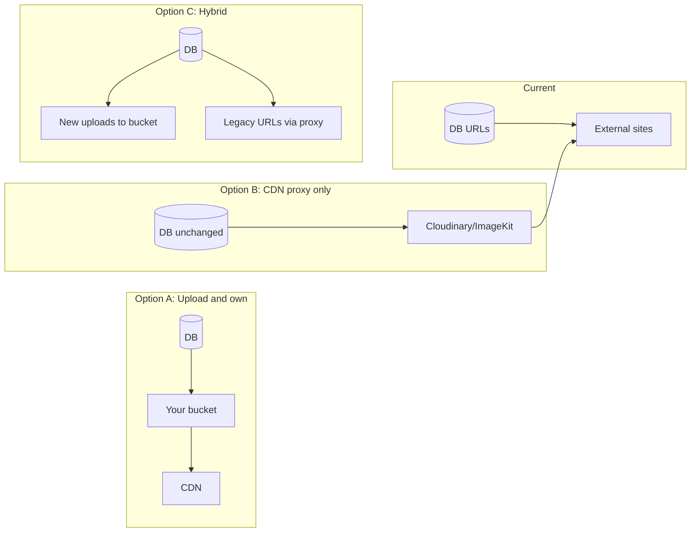

# CDN image migration strategy and base cost

## Current state

- **Schema**: [prisma/schema.prisma](../prisma/schema.prisma) stores image URLs as optional strings:
  - `PerfumeHouse.image` (line 45)
  - `Perfume.image` (line 65)
- **Volume** (from [backups/archived](../backups/archived) manifests): ~7,445 houses, ~42,058 perfumes. Backup JSON shows **~48,490 non-empty image fields** (many URLs point to create-cdn.net, shop CDNs, Unsplash, basenotes, etc.).
- **Usage**: URLs are used directly in `` in [app/routes](../app/routes), [app/components](../app/components). [app/utils/styleUtils.ts](../app/utils/styleUtils.ts) uses `validImageRegex` to detect a legacy pattern and fall back to `bottleBanner` when invalid. [app/utils/imageOptimization.ts](../app/utils/imageOptimization.ts) already supports an `IMAGE_CDN_URL` env for Cloudinary/ImageKit/Cloudflare (proxy-from-URL).
- **Risks of staying on external URLs**: broken links when third-party sites change or remove images, no control over availability or performance, mixed origins and potential CORS/security issues.

---

## Strategy options

| Approach              | Description                                                                                                                                               | Pros                                                                                                       | Cons                                                                                                                                     |
| --------------------- | --------------------------------------------------------------------------------------------------------------------------------------------------------- | ---------------------------------------------------------------------------------------------------------- | ---------------------------------------------------------------------------------------------------------------------------------------- |
| **A. Upload and own** | One-time script: for each row with `image`, download from URL → upload to your storage (e.g. R2/S3) → update DB with new CDN URL.                         | Full control, no dependency on external sites, predictable storage cost, can normalize format (e.g. WebP). | One-time migration effort; need to handle failures (404, timeouts) and dedupe by URL.                                                    |
| **B. CDN proxy only** | Keep DB URLs as-is; put a proxy in front (e.g. set `IMAGE_CDN_URL` to Cloudinary/ImageKit "fetch" URL). They pull from origin on first request and cache. | No migration, quick to enable; your code already supports it.                                              | Still dependent on origin availability; proxy cost per request/transform; some services limit or charge for "fetch" from arbitrary URLs. |
| **C. Hybrid**         | New/edited images upload to your bucket and get CDN URLs; legacy rows keep current URL and are gradually migrated or proxied.                             | Spreads migration over time; new content under your control.                                               | Two code paths; legacy URLs can still break.                                                                                             |

**Recommendation:** **Option A** for a "central location + CDN" you control, with a **batch migration script** and **Cloudflare R2** (or S3-compatible bucket) + CDN. Option B is useful as a short-term improvement without migration; Option C if you want to migrate incrementally.

---

## Recommended implementation (Option A)

1. **Choose storage + CDN**
   - **Cloudflare R2**: S3-compatible, $0.015/GB-month, **zero egress** when using Cloudflare CDN; 10 GB free/month. Good fit for image hosting.
   - **Alternatives**: AWS S3 + CloudFront (egress cost), or image-specific (Cloudinary/ImageKit) if you want transforms/optimization as a service.
2. **Naming and structure**
   - Store objects by type and stable id to avoid re-uploading: e.g. `perfumes/{perfumeId}.webp`, `houses/{houseId}.webp`. Use content hash or "last URL" in a small metadata table if you need to detect changes later.
3. **Migration script (outline)**
   - Use Prisma to stream or paginate `Perfume` and `PerfumeHouse` where `image` is not null/empty.
   - For each record:
     - Skip if `image` already points to your CDN domain (so you can re-run safely).
     - Download image (with timeout and retries; handle 404/403 by leaving DB unchanged or setting to null).
     - Optionally convert to WebP (e.g. using existing [app/utils/imageConversion.ts](../app/utils/imageConversion.ts) or sharp).
     - Upload to R2 (e.g. `@aws-sdk/client-s3` with R2 endpoint).
     - Update record: `image = "https://your-cdn.example.com/perfumes/{id}.webp"`.
   - Run in batches (e.g. 50–100 concurrency) to avoid overloading origins; persist progress (e.g. last processed id) so you can resume.
   - Log failures (URL, id, error) to a file for manual review or retry.
4. **App changes**
   - No schema change required (still `String?`).
   - After migration, optionally remove or relax `validImageRegex` fallback for old patterns.
   - Keep or remove `IMAGE_CDN_URL` depending on whether you still want on-the-fly transforms (e.g. Cloudinary) or serve directly from your CDN URLs.
5. **Rollback**
   - Keep a backup of current `image` values (e.g. export `id, image` to CSV) before updating, so you can revert if needed.

---

## Base cost estimate (Option A, ~48.5k images)

Assumptions:

- **Unique images**: ~48.5k non-empty fields; many URLs may repeat (same Unsplash/shop URL). Assume **~30–40k unique** after dedupe.
- **Size**: Average ~100–200 KB per image (WebP); assume **150 KB** → **~4.5–6 GB** total storage.

| Item                   | Estimate                                                  | Cloudflare R2 (example)                                                        |
| ---------------------- | --------------------------------------------------------- | ------------------------------------------------------------------------------ |
| **Storage**            | ~5–6 GB                                                   | ~$0.08–0.09/month (above 10 GB free tier if you exceed it; first 10 GB free)   |
| **Egress**             | 0 (R2 → Cloudflare CDN)                                   | $0                                                                             |
| **Class A/B requests** | Reads/writes during migration + ongoing reads             | Typically well within free tier for this scale; R2 pricing is low for requests |
| **Migration compute**  | One-time: run script locally or on a small VM             | Negligible (hours of run time)                                                 |
| **CDN**                | Served via Cloudflare (e.g. custom domain in front of R2) | $0 on Free plan for normal traffic                                             |

**Rough total: ~$0–5/month** at current scale, depending on whether you stay within free tiers. The main cost is your time to build and run the migration and handle edge cases (failed downloads, rate limits from origins).

If you use **S3 + CloudFront** instead: storage similar (~$0.12/month for 6 GB); egress at $0.09/GB can add up with traffic (e.g. 100 GB/month ≈ $9). R2 is more cost-effective for CDN-style delivery.

---

## Summary

- **Strategy:** Migrate to your own storage + CDN (Option A) via a one-off script that downloads from current URLs, uploads to R2 (or S3), and updates `Perfume.image` and `PerfumeHouse.image`. Use R2 for low cost and zero egress.
- **Volume:** ~48.5k image fields, ~30–40k likely unique, ~5–6 GB storage.
- **Base cost:** On the order of **$0–5/month** at this scale with Cloudflare R2 and CDN; more if you use S3 + CloudFront (mainly egress).
- **Next steps:** Add a migration script (and optionally a small "image migration status" or backup table), choose R2 vs S3, then run in batches with resume and failure logging.
