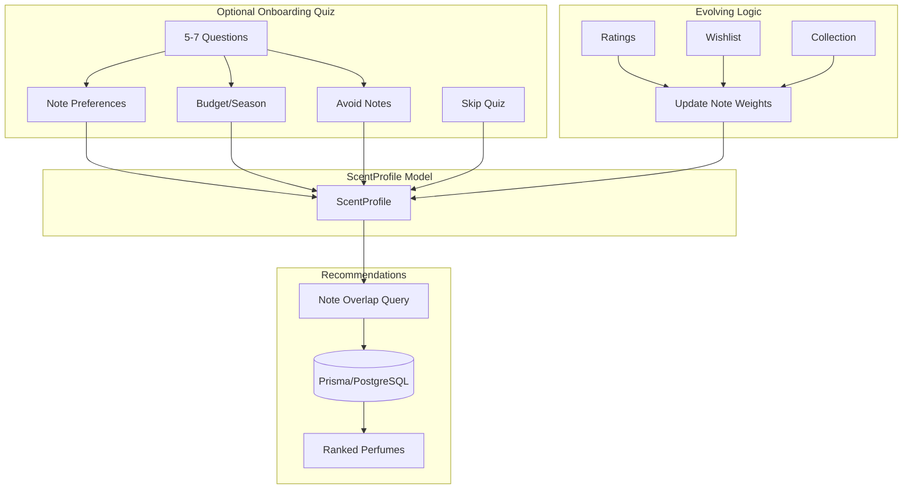

# Onboard Quiz: Personalized Scent Profiles (Rules-Based, No ML)

Rules-based implementation of personalized scent profiles with an optional onboarding quiz and evolving taste model. No ML dependencies.

## Design Principles

- **Quiz is optional:** Users can skip and still receive recommendations based on ratings, wishlist, and collection activity.
- **Profile evolves from behavior:** Even without the quiz, profiles build from explicit signals (ratings 4+, wishlist, collection).
- **Explainable:** Recommendations show why ("Shares vanilla, sandalwood with perfumes you liked").

---

## Architecture



---

## Data Model

```prisma
model ScentProfile {
  id                  String   @id @default(cuid())
  userId              String   @unique
  noteWeights         Json     // { noteId: number }
  avoidNoteIds        Json     // string[]
  preferredPriceRange Json?    // { min?: number, max?: number }
  seasonHint          String?  // "summer" | "winter" | "all" | null
  browsingStyle       String?  // "explorer" | "focused" | "trader"
  lastQuizAt          DateTime?
  createdAt           DateTime @default(now())
  updatedAt           DateTime @updatedAt
  user                User     @relation(fields: [userId], references: [id], onDelete: Cascade)

  @@index([userId])
}
```

Add to `User` model:
```prisma
ScentProfile  ScentProfile?
```

---

## Implementation Checklist

### Phase 1: Schema and Core Model

- [ ] Add `ScentProfile` model to `prisma/schema.prisma`
- [ ] Add `ScentProfile` relation to `User` model
- [ ] Run `npx prisma migrate dev --name add_scent_profile`
- [ ] Create `app/models/scent-profile.server.ts` with:
  - [ ] `getOrCreateScentProfile(userId)` – returns existing or empty profile
  - [ ] `updateScentProfileFromQuiz(userId, quizData)` – persist quiz answers
  - [ ] `updateScentProfileFromBehavior(userId, event)` – evolve from rating/wishlist/collection

### Phase 2: Optional Onboarding Quiz

- [ ] Create route `app/routes/onboarding/scent-quiz.tsx` (or `scent-quiz.tsx` under onboarding)
- [ ] Add quiz entry point in UI (e.g., banner on homepage, link in profile/settings)
- [ ] Implement 5–7 quiz screens:
  - [ ] Note preferences (pick 3–5 liked families: floral, woody, citrus, oriental, fresh, spicy, gourmand)
  - [ ] Avoid notes (optional multi-select)
  - [ ] Budget / price range (optional)
  - [ ] Season preference (optional: summer, winter, all)
  - [ ] Browsing style (optional: explorer, focused, trader)
- [ ] Add "Skip quiz" option on first screen and allow access later from settings
- [ ] Store quiz results via `updateScentProfileFromQuiz`
- [ ] Add route to `app/routes.ts`

### Phase 3: Profile Evolution (Behavior-Based)

- [ ] Hook into rating submit: when `UserPerfumeRating` created/updated:
  - [ ] If overall >= 4: increment `noteWeights` for that perfume's notes (from `PerfumeNoteRelation`)
  - [ ] If overall <= 2: add notes to `avoidNoteIds` (or decrement weights)
- [ ] Hook into wishlist add: when `UserPerfumeWishlist` created:
  - [ ] Increment `noteWeights` for that perfume's notes
- [ ] Hook into collection add: when `UserPerfume` created:
  - [ ] Increment `noteWeights` for that perfume's notes
- [ ] Ensure `getOrCreateScentProfile` creates an empty profile for users with no quiz (so evolution can still populate it)

### Phase 4: Recommendation Service

- [ ] Create `app/services/recommendations/` (or `app/utils/recommendations.server.ts`)
- [ ] Implement `getSimilarPerfumes(perfumeId, limit)`:
  - [ ] Get note IDs for perfume from `PerfumeNoteRelation`
  - [ ] Find other perfumes with most note overlap, exclude source perfume
  - [ ] Order by overlap count, return top N
- [ ] Implement `getPersonalizedForUser(userId, limit)`:
  - [ ] Load `ScentProfile` (or create empty)
  - [ ] If profile has `noteWeights`: find perfumes with notes in preferred set, weighted by overlap
  - [ ] Exclude perfumes with notes in `avoidNoteIds`
  - [ ] Apply `preferredPriceRange` filter if set
  - [ ] If no profile data: return popular/trending perfumes as fallback

### Phase 5: UI Integration

- [ ] Add "Similar perfumes" block to perfume detail page (`app/routes/perfume.tsx`)
- [ ] Add "Recommended for you" section to homepage or dashboard (if applicable)
- [ ] Add link to retake or complete quiz in user profile/settings
- [ ] Ensure recommendations gracefully handle users with no profile data (fallback)

### Phase 6: Abstraction for Future ML

- [ ] Define `RecommendationService` interface in `app/services/recommendations/types.ts`:
  - [ ] `getSimilarPerfumes(perfumeId: string, limit: number): Promise<Perfume[]>`
  - [ ] `getPersonalizedForUser(userId: string, limit: number): Promise<Perfume[]>`
- [ ] Implement `RulesRecommendationService` that satisfies this interface
- [ ] Use the interface in route loaders so ML implementation can be swapped in later

### Phase 7: Tests and Polish

- [ ] Unit tests for `scent-profile.server.ts` (quiz update, behavior evolution)
- [ ] Unit tests for recommendation logic (note overlap, avoid list)
- [ ] Integration test for quiz flow (submit, skip, retake)
- [ ] Verify skip path: user with no quiz still gets recommendations from behavior

---

## Key Code Touchpoints

| File | Purpose |
|------|---------|
| `prisma/schema.prisma` | Add `ScentProfile` model |
| `app/models/scent-profile.server.ts` | CRUD, quiz persistence, evolution logic |
| `app/routes/onboarding/scent-quiz.tsx` | Quiz UI (optional flow) |
| `app/services/recommendations/rules.service.ts` | Note-overlap recommendation logic |
| `app/services/recommendations/types.ts` | `RecommendationService` interface |
| `app/routes/perfume.tsx` | "Similar perfumes" block |
| `app/models/user.server.ts` or rating/wishlist handlers | Evolution hooks |

---

## Pros and Cons

| Pros | Cons |
|------|------|
| No external dependencies or API keys | Note overlap is literal – "Tobacco" vs "Smoky" won't match |
| Fully explainable recommendations | Cannot use review text meaningfully |
| Fast queries via Prisma/PostgreSQL | No natural-language search |
| Ships quickly, no infra beyond DB | Limited discovery beyond note families |
| Quiz optional – works for users who skip | |
| Zero runtime cost for ML | |
